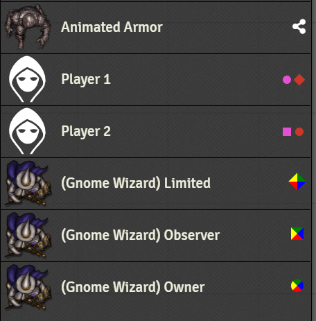
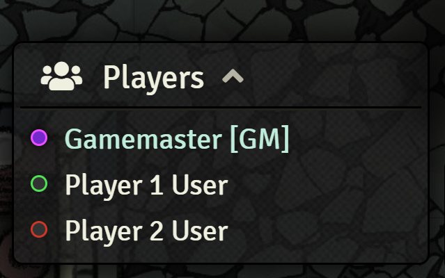

# Ownership Viewer
(Formerly known as 'Permission Viewer')

This Foundry VTT module displays colored diamonds/squares/circles to represent the players who have limited/observer/owner ownership of Documents (Actors, Journals, Items, Cards, Macros, etc..).

It makes it very easy to see at a glance which journal, actor, item, etc. is shared with your players. The shapes are :

* Diamond : Limited ownership
* Square : Observer ownership
* Circle : Full ownership

The color of the dots represents the color of the player. In the case of a default ownership set for `All Players`, the shape will have the Blue/Yellow/Green/Red colors.

# Known Issues
Module compatibility issues:
* smol-foundry: resizing Scenes to smaller values will cause PV icons to be offset.

# Changelog
`https://github.com/League-of-Foundry-Developers/fvtt-module-permission-viewer/CHANGELOG.md`

# License
This Foundry VTT module, writen by KaKaRoTo, is licensed under a [Creative Commons Attribution 4.0 International License](http://creativecommons.org/licenses/by/4.0/).

This work is licensed under Foundry Virtual Tabletop [EULA - Limited License Agreement for module development v 0.1.6](http://foundryvtt.com/pages/license.html).
